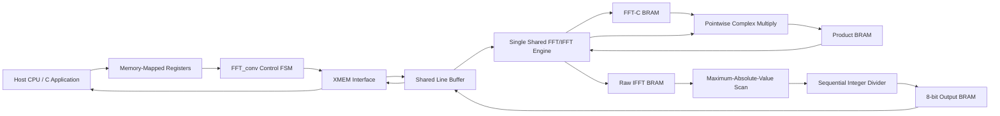

# ⚙️ FFT-Based Circular Convolution Hardware Accelerator

## Overview

The hardware accelerator computes the circular convolution of two signed input vectors:

```text
C[0 ... N-1]
X[0 ... N-1]
```

The required output is:

```text
Y[i] = Σ C[k] · X[(i-k) mod N]
```

Instead of evaluating the convolution directly with approximately `N²` multiply-accumulate operations, the accelerator uses the convolution theorem:

```text
Y = IFFT(FFT(C) · FFT(X))
```

The current implementation supports transform lengths up to:

```text
MAX_N = 256
```

`N` must be a power of two.

---

## 🧱 High-Level Architecture



The design uses one shared FFT engine for all three transforms:

```text
FFT(C) → FFT(X) → IFFT
```

This resource-sharing approach greatly reduces FPGA area compared with three parallel FFT engines. The trade-off is that the three transforms run sequentially.

---

## 📁 Main Hardware Files

| File | Purpose |
|---|---|
| `FFT_conv.sv` | Top-level accelerator, control FSM, XMEM access, intermediate BRAMs, pointwise multiplication, normalization and host communication |
| `fft_engine.sv` | Shared iterative radix-2 FFT/IFFT engine |
| `div.sv` | Sequential unsigned integer divider used during output normalization |
| `FFT_conv.f` | Source-file list used by the K5 synthesis flow |
| `FFT_conv.qsf` | Quartus project and device settings |

---

## 🔌 Host Register Interface

The C application controls the accelerator through seven memory-mapped registers.

| Index | Register | Direction | Purpose |
|---:|---|---|---|
| `0` | `C_ADDR` | CPU → HW | XMEM start address of vector `C` |
| `1` | `X_ADDR` | CPU → HW | XMEM start address of vector `X` |
| `2` | `Y_ADDR` | CPU → HW | XMEM start address of output vector `Y` |
| `3` | `N` | CPU → HW | Number of vector elements |
| `4` | `MODE` | CPU → HW | Software mode value; currently not used by the hardware datapath |
| `5` | `START` | CPU → HW | Starts accelerator execution |
| `6` | `DONE` | HW → CPU | Indicates that the output has been written to XMEM |

The C application performs the following sequence:

```text
Load C and X into XMEM
        ↓
Write C_ADDR, X_ADDR, Y_ADDR, N and MODE
        ↓
Write START = 1
        ↓
Poll DONE
        ↓
Read Y from XMEM
```

> **MODE behavior:** `MODE=0` and `MODE=1` select the naive and FFT algorithms in the software reference flow. The current hardware accelerator always executes the FFT-based path.

---

## 🔄 Complete Hardware Processing Flow

```text
Read C from XMEM
        ↓
Stream C into the FFT engine
        ↓
Compute FFT(C)
        ↓
Store FFT(C) in block RAM
        ↓
Read X from XMEM
        ↓
Stream X into the same FFT engine
        ↓
Compute FFT(X)
        ↓
Pointwise complex multiplication
        ↓
Store the frequency-domain products in block RAM
        ↓
Load the products into the shared FFT engine
        ↓
Compute the IFFT
        ↓
Store the real IFFT output
        ↓
Find the maximum absolute output value
        ↓
Normalize each value to signed 8-bit
        ↓
Store the normalized vector in block RAM
        ↓
Assemble XMEM lines and write Y to memory
        ↓
Assert DONE
```

---

## 📥 Streaming Input Path

The final architecture does not keep complete byte arrays for `C` and `X` in registers.

Each XMEM line is first captured in one shared register:

```systemverilog
logic [BYTES_PER_XMEM_LINE-1:0][7:0] line_buf;
```

The bytes are then sent to the FFT engine one per clock cycle:

```text
XMEM line → line_buf → one signed byte per cycle → FFT engine
```

Each signed 8-bit value is converted to the internal fixed-point representation:

```systemverilog
eng_load_re = $signed(line_buf[byte_idx]) <<< 12;
eng_load_im = 0;
```

This removes the large variable barrel shifters and write decoders that were created by the original `c_buf` and `x_buf` register arrays.

---

## 💾 Block-RAM Organization

The main data arrays use synchronous RAM coding templates and the Quartus attribute:

```systemverilog
(* ramstyle = "M9K" *)
```

| Memory | Size | Purpose |
|---|---:|---|
| `buf_re` | `256 × 32` | FFT engine real working buffer |
| `buf_im` | `256 × 32` | FFT engine imaginary working buffer |
| `tw_rom_re` | `128 × 18` | Real twiddle-factor ROM |
| `tw_rom_im` | `128 × 18` | Imaginary twiddle-factor ROM |
| `cfft_re_mem` | `256 × 32` | Real part of `FFT(C)` |
| `cfft_im_mem` | `256 × 32` | Imaginary part of `FFT(C)` |
| `mul_re_mem` | `256 × 32` | Real pointwise products |
| `mul_im_mem` | `256 × 32` | Imaginary pointwise products |
| `yraw_mem` | `256 × 32` | Raw real IFFT output |
| `y_mem` | `256 × 8` | Normalized signed 8-bit output |

The memories do not use full-array reset loops. Their contents are overwritten before use, allowing Quartus to infer dedicated FPGA memory instead of registers and large multiplexers.

---

## 🧮 Shared FFT/IFFT Engine

The `fft_engine` module implements an iterative radix-2 decimation-in-time FFT.

The engine is reused for:

```text
1. Forward FFT of C
2. Forward FFT of X
3. Inverse FFT of the pointwise product
```

### Bit-Reversed Loading

Input data is supplied in natural order, but written into the engine RAM at bit-reversed addresses.

The optimized implementation calculates `log2(N)` once and stores it in `log2n_r`. The bit reversal is implemented as a fixed-width wire permutation followed by one shallow barrel shift.

```text
Natural input order → bit-reversed RAM addresses → iterative FFT stages
```

This replaced the original deep `while` and `for` loops that created the longest combinational timing path.

### Butterfly Sequence

Each radix-2 butterfly is serialized through the following states:

```text
S_RD_EVEN
    ↓
S_RD_ODD
    ↓
S_MUL1
    ↓
S_MUL2
    ↓
S_WR_EVEN
    ↓
S_WR_ODD
```

The butterfly computes:

```text
u = even input
v = odd input
t = v · W

even output = (u + t) / 2
odd output  = (u - t) / 2
```

The division by two at every stage reduces fixed-point growth and helps prevent overflow.

---

## ✖️ Pipelined Complex Multiplication

Complex multiplication is used both inside the FFT butterfly and in the pointwise multiplication stage.

For:

```text
A = Ar + jAi
B = Br + jBi
```

the product is:

```text
Real = Ar·Br - Ai·Bi
Imag = Ar·Bi + Ai·Br
```

The final design splits the operation into two pipeline stages.

### Stage 1 — Raw Products

```text
Ar·Br
Ai·Bi
Ar·Bi
Ai·Br
```

The raw `32 × 32` multiplication results are stored in registers at the DSP output.

### Stage 2 — Q15 Round and Combine

```text
Real = q15_round(Ar·Br) - q15_round(Ai·Bi)
Imag = q15_round(Ar·Bi) + q15_round(Ai·Br)
```

This separates the multiplier delay from the rounding and adder delay while preserving exactly the same numerical result.

---

## 📐 Twiddle Factors and Fixed-Point Format

The FFT uses precomputed twiddle factors:

```text
Wₙᵏ = cos(2πk/N) - j·sin(2πk/N)
```

They are stored as signed 18-bit constants using Q15 scaling.

A raw fixed-point multiplication is rounded using:

```text
q15_result = (raw_product + 2¹⁴) >> 15
```

The addition of `2¹⁴` performs rounding before the Q15 shift.

For the inverse transform, the sign of the imaginary twiddle component is reversed.

---

## 📉 Output Normalization

After the IFFT, only the real output component is required.

The accelerator first scans the complete vector and calculates:

```text
max_abs = max(|Yraw[i]|)
```

Each element is then normalized to the signed 8-bit range:

```text
Y[i] = floor(Yraw[i] · 127 / max_abs)
```

A single sequential divider is reused for all output elements. This saves area at the cost of additional cycles.

The result is stored in `y_mem` and later written to XMEM.

---

## 📤 Output Writeback

The output BRAM is read one byte per cycle.

The top-level controller fills `line_buf` using static lane indexing and then writes one complete XMEM line:

```text
y_mem → line_buf → XMEM
```

This row-fill method replaced the original variable-offset byte-array write logic that generated very large barrel shifters.

---

## 🎛️ Top-Level FSM

The main controller follows this sequence:

```text
IDLE
  ↓
INIT_LOAD_C
  ↓
LOAD_C_READ ↔ LOAD_C_FEED
  ↓
START_FFT_C
  ↓
WAIT_FFT_C
  ↓
SAVE_FFT_C
  ↓
INIT_LOAD_X
  ↓
LOAD_X_READ ↔ LOAD_X_FEED
  ↓
START_FFT_X
  ↓
WAIT_FFT_X
  ↓
POINTWISE_MUL
  ↓
LOAD_ENGINE_MUL
  ↓
START_IFFT
  ↓
WAIT_IFFT
  ↓
SAVE_IFFT
  ↓
FIND_MAX
  ↓
NORMALIZE_READ
  ↓
NORMALIZE_START_DIV
  ↓
NORMALIZE_WAIT_DIV
  ↓
INIT_WRITE_Y
  ↓
WRITE_Y_FILL ↔ WRITE_Y
  ↓
DONE
```

---

## 🛠️ Architecture Optimization

The original design passed synthesis but failed FPGA fitting because it required far more logic than the selected MAX 10 device contained.

The area reduction was achieved through three architectural changes:

1. **One shared FFT engine** instead of separate engines for `FFT(C)`, `FFT(X)` and `IFFT`.
2. **Block-RAM storage** instead of register arrays, whole-array ports and combinational outputs for all 256 elements.
3. **Serialized byte access** using one shared line buffer instead of variable-offset byte-array barrel shifters.

### Area Improvement

| Design stage | Logic elements | Registers | Internal memory bits |
|---|---:|---:|---:|
| Original design — three FFT engines | `475,238` | `85,461` | `0` |
| BRAM conversion stage | `104,177` | `7,107` | `57,344` |
| Byte-array elimination stage | `5,167` | `1,230` | `59,392` |
| Final timing-optimized design | `4,145` | — | — |
| MAX 10 device capacity | `49,760` | — | `1,677,312` |

The architecture therefore changed from a design requiring approximately `955%` of the device logic to a design using less than `10%` of the available logic.

The serialization increased total execution time from approximately `629,000` cycles to approximately `643,000` cycles, an increase of only about `2%`, while reducing logic usage by more than two orders of magnitude.

---

## ⏱️ Timing Optimization

After the design fit in the FPGA, the next target was to increase `Fmax` beyond `50 MHz`.

### Timing Progress

| Stage | Fmax | Result |
|---|---:|---|
| Initial BRAM architecture | `30.81 MHz` | Below target |
| Complex-multiply pipeline | `32.57 MHz` | Small improvement |
| Optimized `calc_log2` and bit reversal | `54.40 MHz` | Target exceeded |

The complex-multiplication pipeline improved timing only slightly because it was not the true critical path.

The STA report showed that the real critical path started at the `N` host register, passed through the original iterative `calc_log2` and variable bit-reversal logic, and ended at the FFT RAM write control.

The final solution used:

```text
Priority encoder for calc_log2
        +
Registered log2n_r
        +
Fixed-width bit reversal
        +
One shallow barrel shift
```

This removed the deep combinational chain and increased `Fmax` to `54.40 MHz`.

The final remaining critical path is a single signed `32 × 32` multiplication. On the MAX 10 device, this multiplication is constructed from multiple `18 × 18` DSP blocks and a partial-product adder chain.

Because `54.40 MHz` exceeds the `50 MHz` target with margin, no further bit-width reduction was required.

---

## ✅ Final Verified Results

Target device:

```text
Intel MAX 10
10M50DAF484C7G
Quartus 24.1 Lite
```

Final status:

| Metric | Result |
|---|---:|
| Logic elements | `4,145` |
| Maximum clock frequency | `71.40 MHz` |
| Fit | Passed |
| Static Timing Analysis | Passed |
| Required frequency target | `50 MHz` |
| Output verification | Bit-exact |

Functional verification included 18 reference runs using impulse, constant and random input vectors with transform lengths including `N=8`, `N=64` and `N=256`. All output bytes matched the reference model.

---

## ⚖️ Main Design Trade-Off

The final architecture prioritizes area efficiency and timing closure through resource sharing:

```text
One FFT/IFFT engine
One normalization divider
BRAM-based intermediate storage
One shared XMEM line buffer
Serialized RAM access
```

This increases latency compared with a fully parallel design, but makes the accelerator practical for the selected FPGA while still meeting the required operating frequency.

---

## ⚠️ Hardware Assumptions

The current design assumes:

```text
N ≤ 256
N is a power of two
Input elements are signed 8-bit values
The operation is circular convolution
C_ADDR, X_ADDR and Y_ADDR point to valid XMEM regions
The output region does not overwrite active input data
The hardware always uses the FFT-based algorithm
```

---

## 🔨 Synthesis, Fit and STA

Run the complete hardware flow:

```bash
set_k5_terminal
cd $MY_K5_XLRS/FFT_conv
qsyn_xlr FFT_conv -all | tee qsyn_FFT_conv_all.log
```

Display the resource-utilization section:

```bash
sed -n '/Analysis & Synthesis Resource Utilization by Entity/,+40p' \
qsyn_output_files/FFT_conv.map.rpt
```

Display the worst timing paths:

```bash
sed -n '1,80p' qsyn_output_files/sta_FFT_conv_worst_paths.rpt
```

Extract critical-path details:

```bash
grep -A 40 -iE "Slow Model|Worst-Case|Critical Path|Data Arrival" \
qsyn_output_files/sta_FFT_conv_worst_paths.rpt | head -70
```
